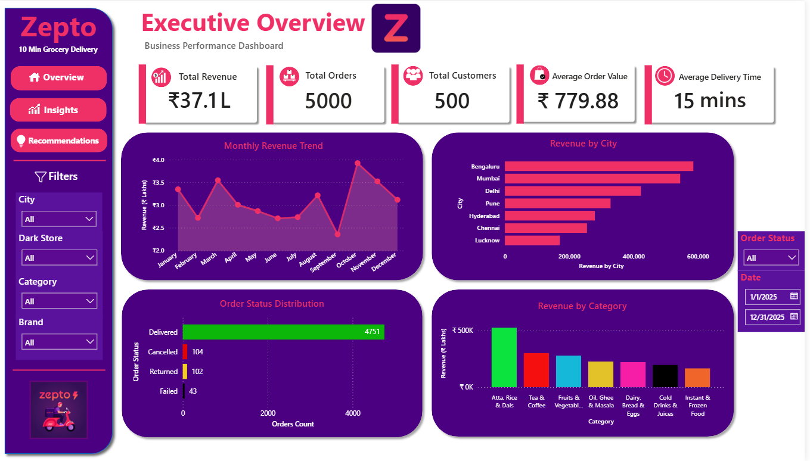
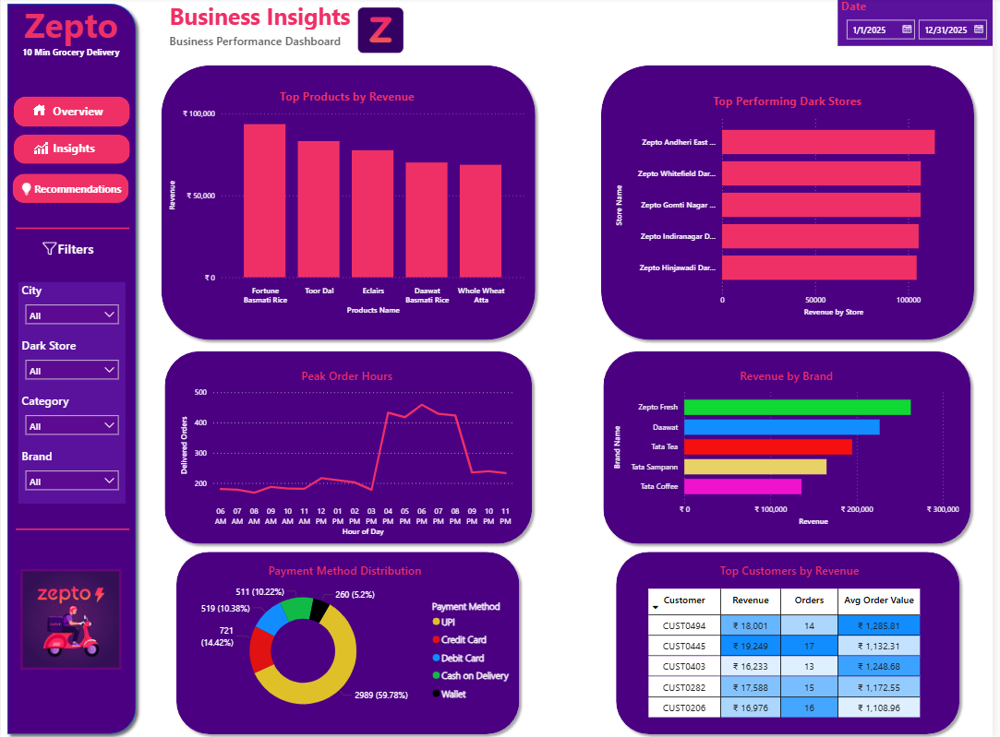
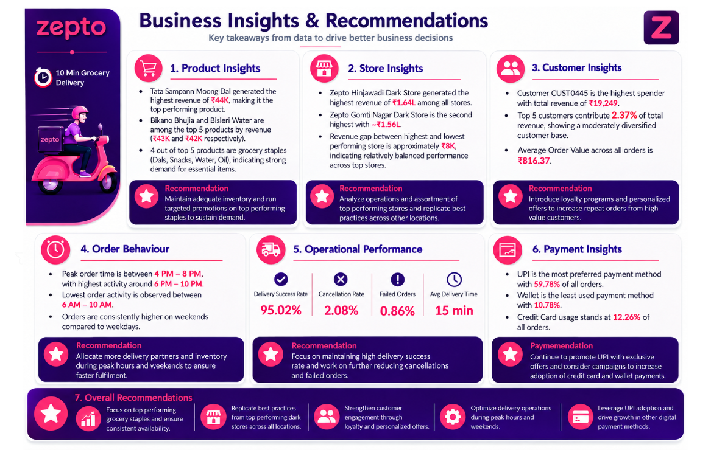

<div align="center">

# 🛒 Zepto Business Performance Dashboard

## End-to-End Business Intelligence Project

**Transforming synthetic transactional data into actionable business insights using SQL Server, Power BI, Power Query & DAX**


</div>

> **Note:** This project is built using a synthetic transactional dataset created for educational and portfolio purposes to demonstrate an end-to-end Business Intelligence workflow.

---

# 📊 Project Overview

This project presents an end-to-end Business Intelligence solution developed using a synthetic transactional dataset representing Zepto's quick-commerce operations across selected Indian cities from **1 January 2025 to 31 December 2025**.

The project demonstrates the complete analytics lifecycle—from SQL Server data preparation and Power Query transformation to dimensional data modeling, DAX measure creation, and interactive Power BI dashboard development.

The dashboards provide a consolidated view of sales performance, customer purchasing behaviour, inventory status, payment trends, order fulfilment, and dark store operations, enabling data-driven business analysis within the defined project scope.

---

# 💼 Business Problem

Quick-commerce businesses generate large volumes of operational and transactional data that must be transformed into meaningful insights for business teams.

This project demonstrates how a structured synthetic dataset can be used to build a centralized Business Intelligence solution for monitoring revenue, customer behaviour, product performance, inventory, payment trends, and dark store operations across selected cities and selected dark stores over a one-year business period.

---

# 🎯 Project Objectives

- Design an end-to-end Business Intelligence workflow.
- Prepare and transform transactional data using SQL Server and Power Query.
- Build a dimensional data model for analytical reporting.
- Develop reusable DAX measures and KPIs.
- Visualize business performance through interactive Power BI dashboards.
- Generate actionable insights to support operational decision-making.

---

# ⭐ Project Highlights

- Synthetic Business Dataset Design
- SQL Server Data Preparation
- Power Query ETL Workflow
- Star Schema Data Modeling
- DAX-Based KPI Development
- Interactive Executive Dashboard
- Business Performance Analytics
- Business Insights & Recommendations

---

# 🛠️ Technology Stack

| Category | Technology |
|-----------|------------|
| Database | SQL Server |
| Business Intelligence | Microsoft Power BI |
| ETL | Power Query |
| Data Modeling | Star Schema |
| Analytics | DAX |
| Data Source | Synthetic CSV Dataset |

---

# 📂 Dataset Overview

The project uses a synthetic relational dataset designed specifically for Business Intelligence analysis and dashboard development.

## Coverage Summary

| Attribute | Details |
|-----------|----------|
| Dataset Type | Synthetic Transactional Dataset |
| Time Period | 1 January 2025 – 31 December 2025 |
| Geographic Scope | Selected Indian Cities |
| Operational Scope | 26 Selected Dark Stores |
| Business Domain | Quick Commerce |

## Dataset Statistics

| Dataset | Records |
|---------|---------:|
| Customer Orders | 5,000 |
| Order Items | 11,205 |
| Customers | 500 |
| Products | 120 |
| Brands | 90 |
| Categories | 20 |
| Dark Stores | 26 |
| Inventory | 2,340 |

---

# 🔄 End-to-End Workflow

```text
Synthetic CSV Datasets
        │
        ▼
SQL Server
        │
        ▼
Power Query (ETL)
        │
        ▼
Star Schema Data Model
        │
        ▼
DAX Measures & KPIs
        │
        ▼
Power BI Dashboard
        │
        ▼
Business Insights & Recommendations
```

---

# 📈 Key Performance Indicators

The following KPIs summarize business performance across the synthetic dataset covering the defined one-year analysis period.

| KPI | Value |
|------|------:|
| Total Revenue | ₹37.1 Lakh |
| Total Orders | 5,000 |
| Total Customers | 500 |
| Average Order Value | ₹779.88 |
| Average Delivery Time | 15 Minutes |

---

# 📸 Dashboard Preview

## Executive Overview



Executive dashboard providing a consolidated view of revenue, orders, customers, monthly sales trends, order status, category performance, and operational KPIs.

---

## Business Analytics



Analytical dashboard highlighting product performance, brand contribution, selected dark store comparison, payment distribution, customer spending behaviour, and peak ordering hours.

---

## Business Insights & Recommendations



Business-focused dashboard summarizing key analytical findings together with practical recommendations for operational improvement.

---

# 💡 Key Business Insights

The dashboard enables analysis of:

- Revenue trends across the one-year business period.
- Comparative performance of selected dark stores.
- Sales contribution by products, brands, and categories.
- Customer purchasing behaviour and average order value.
- Payment method distribution across transactions.
- Peak ordering hours and order activity trends.
- Delivery performance, cancellations, and fulfilment metrics.

---

# 📌 Strategic Recommendations

Based on the dashboard analysis, potential business actions include:

- Maintain adequate inventory for consistently high-demand products.
- Benchmark operational practices of high-performing dark stores.
- Improve customer retention through targeted engagement initiatives.
- Optimize workforce allocation during peak ordering hours.
- Encourage digital payment adoption through promotional campaigns.

---

# 📁 Repository Structure

```text
Zepto-Business-Performance-Dashboard/
│
├── Dashboard/
│   └── Zepto_Business_Performance_Dashboard.pbix
├── SQL Scripts/
│   ├── Database_Creation.sql
│   ├── Data_Insertion.sql
│   └── Business_Queries.sql
├── Images/
│   ├── 01_Executive_Overview.png
│   ├── 02_Business_Analytics.png
│   └── 03_Business_Insights_Recommendations.png
├── Datasets/
│   └── README.md
└── README.md
```

---

# ▶️ Getting Started

1. Clone this repository.
2. Open the PBIX file using Microsoft Power BI Desktop.
3. Update the data source paths if required.
4. Refresh the data model.
5. Explore the interactive dashboards and business insights.

---

# 🔮 Future Enhancements

- Scale the project using larger transactional datasets.
- Expand analysis to additional cities and dark stores.
- Integrate real-time data sources.
- Deploy dashboards through Power BI Service.
- Add demand forecasting using Machine Learning.
- Implement customer segmentation and predictive analytics.

---

# 👨‍💻 Author

**Vasu Bhardwaj**

**Aspiring Data Analyst | SQL | Power BI | Python | Business Intelligence**

---

# ⭐ Support

If you found this project valuable or learned something from it, please consider giving this repository a **⭐ Star**. Your support helps increase the visibility of the project and motivates continued development of high-quality data analytics projects.

---

<div align="center">

### ⭐ If you found this project helpful, consider giving it a Star!

**Built with ❤️ by Vasu Bhardwaj**

</div>
